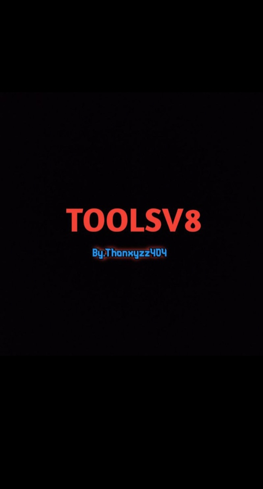

# TOOLS V8

Repository ini berisi koleksi alat dan skrip untuk Termux.

## Screenshot



## Instalasi 

Untuk mengupgrade Toolsv8.

```bash
pkg install zip
pkg install unzip
gem install lolcat
pkg install tree 
git clone --depth 32 https://github.com/Zero556723/Goblok
cd Goblok 
bash Update.sh

## Untuk menjalankan ulang ketik perintah.

ls
cd Goblok 
bash Thonxyzz404.sh
