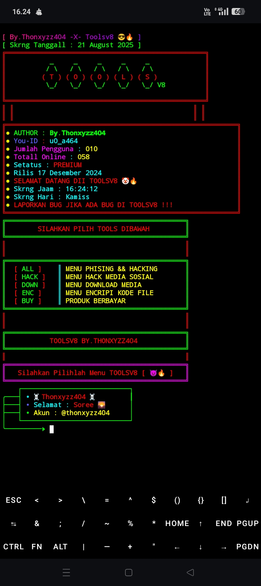

# TOOLS V8

Repository ini berisi koleksi alat dan skrip untuk Termux.

## Screenshot



## Instalasi 

Untuk mengupgrade Toolsv8.

```bash
rm -rf Goblok
rm /data/data/com.termux/files/home/.otentikasi
pkg install zip
pkg install unzip
gem install lolcat
pkg install tree 
git clone --depth 32 https://github.com/Zero556723/Goblok
cd Goblok 
bash Decode_Peleer.sh

## Kalau Mau langsung Aja Buy Ke:
t.me/Thonxyzz404  # Telegram 
